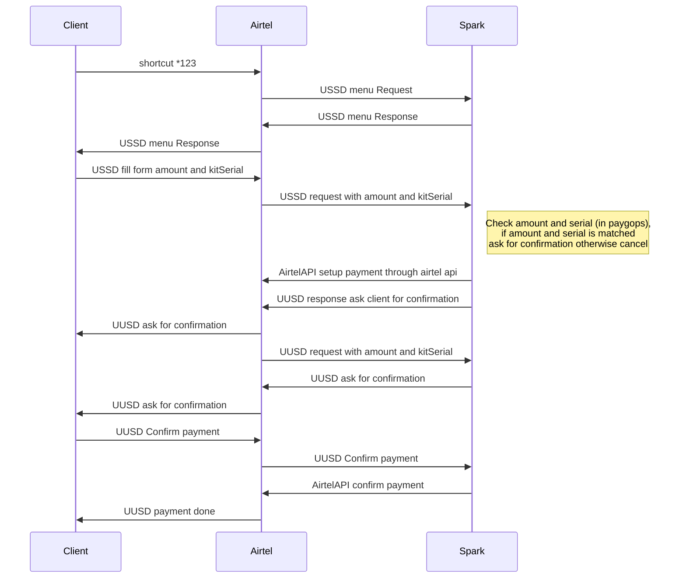

# SparkAirtel

```mermaid
sequenceDiagram
    Client->>Airtel: shortcut *123
    Airtel->>Spark: USSD menu Request
    Spark->>Airtel: USSD menu Response
    Airtel->>Client: USSD menu Response
    Client->>Airtel: USSD fill form amount and kitSerial
    Airtel->>Spark: USSD request with amount and kitSerial
    Note right of Spark: Check amount and serial (in paygops),<br/>if amount and serial is matched<br/> ask for confirmation otherwise cancel
    Spark->>Airtel: AirtelAPI setup payment through airtel api
    Spark->>Airtel: UUSD response ask client for confirmation
    Airtel->>Client: UUSD ask for confirmation
    Airtel->>Spark: UUSD request with amount and kitSerial
    Spark->>Airtel: UUSD ask for confirmation
    Airtel->>Client: UUSD ask for confirmation
    Client->>Airtel: UUSD Confirm payment
    Airtel->>Spark: UUSD Confirm payment
    Spark->>Airtel: AirtelAPI confirm payment
    Airtel->>Client: UUSD payment done
    
```

